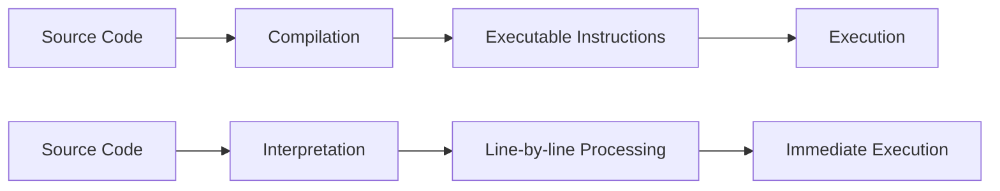

# Chapter 1: What's the Scope?

By the time you've written your first few programs, you're likely getting somewhat comfortable with creating variables and storing values in them. Working with variables is one of the most foundational things we do in programming!

But you may not have considered very closely the underlying mechanisms used by the engine to organize and manage these variables.

<Note>
  **How does JS know which variables are accessible by any given statement, and how does it handle two variables of the same name?**
</Note>

The answers to questions like these take the form of well-defined rules called **scope**. This book will dig through all aspects of scope—how it works, what it's useful for, gotchas to avoid—and then point toward common scope patterns that guide the structure of programs.

## About This Book

Welcome to book 2 in the *You Don't Know JS Yet* series! If you already finished *Get Started* (the first book), you're in the right spot! If not, before you proceed I encourage you to *start there* for the best foundation.

<Steps>
  <Step title="Focus on the Scope System">
    Our focus will be the first of three pillars in the JS language: the scope system and its function closures, as well as the power of the module design pattern.
  </Step>
  <Step title="Understand Two-Phase Processing">
    JS is parsed/compiled in a separate phase **before execution begins**. The code author's decisions on where to place variables, functions, and blocks are analyzed according to the rules of scope during compilation.
  </Step>
  <Step title="Master Closures">
    Functions are first-class values that maintain their original scope no matter where they're executed. This is called closure.
  </Step>
</Steps>

## Compiled vs. Interpreted

You may have heard of *code compilation* before, but perhaps it seems like a mysterious black box where source code slides in one end and executable programs pop out the other.

### What is Compilation?

**Code compilation** is a set of steps that process the text of your code and turn it into a list of instructions the computer can understand. Typically, the whole source code is transformed at once, and those resulting instructions are saved as output that can later be executed.

### What is Interpretation?

**Interpretation** performs a similar task to compilation, in that it transforms your program into machine-understandable instructions. But the processing model is different:

<Note>
  Unlike a program being compiled all at once, with interpretation the source code is transformed **line by line**; each line or statement is executed before immediately proceeding to processing the next line.
</Note>



<Tip>
  Modern JS engines actually employ numerous variations of both compilation and interpretation in the handling of JS programs.
</Tip>

### Is JavaScript Compiled?

Recall that we surveyed this topic in Chapter 1 of the *Get Started* book. Our conclusion there is that **JS is most accurately portrayed as a compiled language**.

<Warning>
  **Why does it matter?** Scope is primarily determined during compilation, so understanding how compilation and execution relate is key in mastering scope.
</Warning>

## Compiling Code

In classic compiler theory, a program is processed by a compiler in three basic stages:

<Steps>
  <Step title="Tokenizing/Lexing">
    Breaking up a string of characters into meaningful chunks called **tokens**.
    
    For example, `var a = 2;` would be broken into: `var`, `a`, `=`, `2`, and `;`.
  </Step>
  
  <Step title="Parsing">
    Taking a stream of tokens and turning it into a tree of nested elements, which collectively represent the grammatical structure of the program. This is called an **Abstract Syntax Tree (AST)**.
    
    For `var a = 2;`, the AST might have:
    - A top-level node called `VariableDeclaration`
    - A child node called `Identifier` (whose value is `a`)
    - Another child called `AssignmentExpression` with a child `NumericLiteral` (whose value is `2`)
  </Step>
  
  <Step title="Code Generation">
    Taking an AST and turning it into executable code. The JS engine takes the AST for `var a = 2;` and turns it into machine instructions to:
    - Create a variable called `a` (including reserving memory)
    - Store a value into `a`
  </Step>
</Steps>

<Note>
  The JS engine is vastly more complex than just these three stages. In the process of parsing and code generation, there are steps to optimize performance, including collapsing redundant elements. Code can even be re-compiled and re-optimized during execution!
</Note>

### Required: Two Phases

To state it as simply as possible:

<Warning>
  The most important observation we can make about processing of JS programs is that it occurs in **(at least) two phases**: **parsing/compilation first, then execution**.
</Warning>

The separation of a parsing/compilation phase from the subsequent execution phase is observable fact, not theory or opinion. There are **three program characteristics** you can observe to prove this:

#### 1. Syntax Errors from the Start

```javascript
var greeting = "Hello";

console.log(greeting);

greeting = ."Hi";
// SyntaxError: unexpected token .
```

This program produces no output (`"Hello"` is not printed), but instead throws a `SyntaxError` about the unexpected `.` token.

<Tip>
  The only way the JS engine could know about the syntax error on the third line, **before** executing the first and second lines, is by parsing the entire program before any of it is executed.
</Tip>

#### 2. Early Errors

```javascript
console.log("Howdy");

saySomething("Hello","Hi");
// Uncaught SyntaxError: Duplicate parameter name not
// allowed in this context

function saySomething(greeting,greeting) {
    "use strict";
    console.log(greeting);
}
```

The `"Howdy"` message is not printed. The `SyntaxError` is thrown before the program is executed, because strict-mode forbids functions to have duplicate parameter names.

<Note>
  How does the JS engine know that `greeting` parameter has been duplicated, and that `saySomething(..)` is in strict-mode (the `"use strict"` pragma appears later in the function body)?
  
  Again, the only reasonable explanation is that the code must first be **fully parsed** before any execution occurs.
</Note>

#### 3. Hoisting

```javascript
function saySomething() {
    var greeting = "Hello";
    {
        greeting = "Howdy";  // error comes from here
        let greeting = "Hi";
        console.log(greeting);
    }
}

saySomething();
// ReferenceError: Cannot access 'greeting' before initialization
```

The `ReferenceError` occurs from the line with `greeting = "Howdy"`. The `greeting` variable for that statement belongs to the declaration on the **next line**, `let greeting = "Hi"`, rather than the `var greeting = "Hello"` statement.

<Warning>
  The only way the JS engine could know, at the line where the error is thrown, that the **next statement** would declare a block-scoped variable of the same name is if the JS engine had already processed this code in an earlier pass, and already set up all the scopes and their variable associations.
  
  This is called the **Temporal Dead Zone (TDZ)**. We'll cover this in more detail in Chapter 5.
</Warning>

## Compiler Speak

With awareness of the two-phase processing of a JS program (compile, then execute), let's turn our attention to how the JS engine identifies variables and determines the scopes of a program as it is compiled.

Let's examine a simple JS program to use for analysis:

```javascript
var students = [
    { id: 14, name: "Kyle" },
    { id: 73, name: "Suzy" },
    { id: 112, name: "Frank" },
    { id: 6, name: "Sarah" }
];

function getStudentName(studentID) {
    for (let student of students) {
        if (student.id == studentID) {
            return student.name;
        }
    }
}

var nextStudent = getStudentName(73);

console.log(nextStudent);
// Suzy
```

### Targets and Sources

Other than declarations, all occurrences of variables/identifiers in a program serve in one of two "roles":

<CardGroup cols={2}>
  <Card title="Target" icon="bullseye-arrow" iconType="duotone">
    The variable is the **target** of an assignment
    
    Examples:
    - `students = [...]`
    - `student` in `for (let student of students)`
    - Function parameter `studentID`
  </Card>
  <Card title="Source" icon="arrow-right-from-bracket" iconType="duotone">
    The variable is the **source** of a value
    
    Examples:
    - `students` in the for-loop
    - `student.id` and `studentID` in the if statement
    - `getStudentName` in the function call
  </Card>
</CardGroup>

<Tip>
  **How do you know if a variable is a *target*?** Check if there is a value being assigned to it. If so, it's a target. If not, then the variable is a source.
</Tip>

#### Targets in Our Program

1. `students = [...]` - clearly an assignment
2. `for (let student of students)` - `student` is assigned a value each iteration
3. `getStudentName(73)` - the argument `73` is assigned to parameter `studentID`
4. `function getStudentName(studentID)` - the function declaration is a special target reference

#### Sources in Our Program

1. `students` in the for-loop statement
2. `student` and `studentID` in the if condition
3. `student.name` in the return statement
4. `getStudentName` and `nextStudent` in their respective references
5. `console` in `console.log(nextStudent)`

<Note>
  Properties like `id`, `name`, and `log` are not variable references - they're properties, not variables.
</Note>

## Cheating: Runtime Scope Modifications

<Warning>
  Scope is determined as the program is compiled, and should not generally be affected by runtime conditions. However, in **non-strict-mode**, there are technically two ways to cheat this rule. **Neither should be used!**
</Warning>

### eval(..)

The `eval(..)` function receives a string of code to compile and execute on the fly during runtime:

```javascript
function badIdea() {
    eval("var oops = 'Ugh!';");
    console.log(oops);
}
badIdea();   // Ugh!
```

If `eval(..)` had not been present, the `oops` variable would not exist and would throw a `ReferenceError`. But `eval(..)` modifies the scope of the `badIdea()` function at runtime.

### with Keyword

The `with` keyword dynamically turns an object into a local scope:

```javascript
var badIdea = { oops: "Ugh!" };

with (badIdea) {
    console.log(oops);   // Ugh!
}
```

<Warning>
  **At all costs, avoid `eval(..)` and `with`.** Neither of these cheats is available in strict-mode. Always use strict-mode!
</Warning>

## Lexical Scope

We've demonstrated that JS's scope is determined at compile time; the term for this kind of scope is **"lexical scope"**. "Lexical" is associated with the "lexing" stage of compilation.

<Note>
  The key idea of "lexical scope" is that **it's controlled entirely by the placement of functions, blocks, and variable declarations, in relation to one another.**
</Note>

### How Lexical Scope Works

- If you place a variable declaration **inside a function**, the compiler associates that declaration with the function's scope
- If a variable is **block-scope declared** (`let`/`const`), it's associated with the nearest enclosing `{ .. }` block
- If a variable is declared with `var`, it's associated with the nearest enclosing **function** (or global scope)

### Variable Lookup

A reference (target or source) for a variable must be resolved as coming from one of the scopes that are *lexically available* to it:

<Steps>
  <Step title="Check Current Scope">
    If the variable is not declared in the current scope...
  </Step>
  <Step title="Check Outer Scope">
    ...the next outer/enclosing scope is consulted
  </Step>
  <Step title="Continue Outward">
    This process continues until either a matching variable declaration is found, or the global scope is reached
  </Step>
</Steps>

<Tip>
  **Important:** Compilation doesn't actually reserve memory for scopes and variables. It creates a **map** of all the lexical scopes that lays out what the program will need while it executes.
  
  While scopes are identified during compilation, they're not actually **created** until runtime, each time a scope needs to run.
</Tip>

## Summary

In this chapter, we established that:

- JavaScript is a **compiled language** with two-phase processing
- The compilation phase determines **lexical scope**
- Variables serve as either **targets** (assigned to) or **sources** (read from)
- Lexical scope is based on the **placement** of variables and blocks in code
- Scope modifications at runtime (via `eval` or `with`) should be avoided

In the next chapter, we'll sketch out the conceptual foundations for lexical scope using helpful metaphors and visual models.
