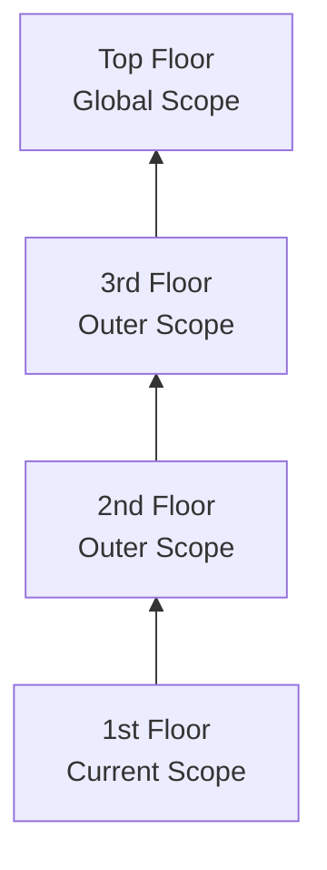

# Chapter 2: Illustrating Lexical Scope

In Chapter 1, we explored how scope is determined during code compilation, a model called "lexical scope." The term "lexical" refers to the first stage of compilation (lexing/parsing).

To properly *reason* about our programs, it's important to have a solid conceptual foundation of how scope works.

<Warning>
  If we rely on guesses and intuition, we may accidentally get the right answers some of the time, but many other times we're far off. **This isn't a recipe for success.**
</Warning>

Like way back in grade school math class, getting the right answer isn't enough if we don't show the correct steps to get there! We need to build accurate and helpful mental models as foundation moving forward.

## Marbles, and Buckets, and Bubbles... Oh My!

One metaphor I've found effective in understanding scope is **sorting colored marbles into buckets of their matching color**.

<Note>
  Imagine you come across a pile of marbles, and notice that all the marbles are colored red, blue, or green. Let's sort all the marbles, dropping the red ones into a red bucket, green into a green bucket, and blue into a blue bucket.
  
  After sorting, when you later need a green marble, you already know the green bucket is where to go to get it.
</Note>

### The Marble Metaphor

- **Marbles** = variables in our program
- **Buckets** = scopes (functions and blocks)
- **Colors** = which scope a marble/variable belongs to

The color of each marble is determined by which *color* scope we find the marble originally created in.

Let's annotate the running program example from Chapter 1 with scope color labels:

```javascript
// outer/global scope: RED(1)

var students = [
    { id: 14, name: "Kyle" },
    { id: 73, name: "Suzy" },
    { id: 112, name: "Frank" },
    { id: 6, name: "Sarah" }
];

function getStudentName(studentID) {
    // function scope: BLUE(2)

    for (let student of students) {
        // loop scope: GREEN(3)

        if (student.id == studentID) {
            return student.name;
        }
    }
}

var nextStudent = getStudentName(73);
console.log(nextStudent);   // Suzy
```

### Visualizing Scope Bubbles

We've designated three scope colors:

<CardGroup cols={3}>
  <Card title="RED (1)" icon="circle" color="#fc9304">
    **Global Scope**
    
    Identifiers:
    - `students`
    - `getStudentName`
    - `nextStudent`
  </Card>
  <Card title="BLUE (2)" icon="circle" color="#4A90E2">
    **Function Scope**
    
    Identifiers:
    - `studentID` (parameter)
  </Card>
  <Card title="GREEN (3)" icon="circle" color="#7ED321">
    **Loop Scope**
    
    Identifiers:
    - `student`
  </Card>
</CardGroup>

<Note>
  Scope bubbles are determined during compilation based on where the functions/blocks are written. Each scope bubble is **entirely contained** within its parent scope bubble—a scope is never partially in two different outer scopes.
</Note>

### Key Takeaways

<Steps>
  <Step title="Variables are colored by their scope">
    Variables are declared in specific scopes, like colored marbles from matching-color buckets.
  </Step>
  <Step title="Nested scopes inherit access">
    Any variable reference in a scope (or deeper nested scopes) will be labeled a marble of that same color—unless shadowed by an intervening scope.
  </Step>
  <Step title="Colors determined at compile-time">
    The determination of colored buckets and their marbles happens during compilation. This information is used for variable "lookups" during execution.
  </Step>
</Steps>

## A Conversation Among Friends

Another useful metaphor for the process of analyzing variables and scopes is to imagine conversations that occur inside the engine as code is processed and executed.

Let's meet the members of the JS engine:

<CardGroup cols={3}>
  <Card title="Engine" icon="engine" iconType="duotone">
    Responsible for start-to-finish compilation and execution of JavaScript programs
  </Card>
  <Card title="Compiler" icon="code" iconType="duotone">
    Handles all the dirty work of parsing and code-generation
  </Card>
  <Card title="Scope Manager" icon="list-check" iconType="duotone">
    Collects and maintains a lookup list of all declared identifiers, and enforces access rules
  </Card>
</CardGroup>

For you to *fully understand* how JavaScript works, you need to begin to *think* like *Engine* (and friends) think, ask the questions they ask, and answer their questions likewise.

### The Compilation Conversation

Let's examine how JS processes our example program, starting with `var students = [...]`.

The first thing *Compiler* will do is perform lexing to break it down into tokens, then parse into an AST. Once *Compiler* gets to code generation:

<Steps>
  <Step title="Compiler asks Scope Manager">
    **Compiler:** "Hey, *Scope Manager* (of the global scope), I found a formal declaration for an identifier called `students`, ever heard of it?"
    
    **Scope Manager:** "Nope, never heard of it, so I just created it for you."
  </Step>
  <Step title="Compiler continues with function">
    **Compiler:** "Hey, *Scope Manager*, I found a formal declaration for `getStudentName`, ever heard of it?"
    
    **Scope Manager:** "Nope, but I just created it for you."
    
    **Compiler:** "Hey, *Scope Manager*, `getStudentName` points to a function, so we need a new scope bucket."
    
    **Scope Manager:** "Got it, here's the scope bucket."
  </Step>
  <Step title="Compiler handles parameters">
    **Compiler:** "Hey, *Scope Manager* (of the function), I found a formal parameter declaration for `studentID`, ever heard of it?"
    
    **Scope Manager:** "Nope, but now it's created in this scope."
  </Step>
</Steps>

### The Execution Conversation

Later, when it comes to execution of the program:

> **Engine:** "Hey, *Scope Manager* (of the global scope), before we begin, can you look up the identifier `getStudentName` so I can assign this function to it?"

> **Scope Manager:** "Yep, here's the variable."

> **Engine:** "Hey, *Scope Manager*, I found a *target* reference for `students`, ever heard of it?"

> **Scope Manager:** "Yes, it was formally declared for this scope, so here it is."

> **Engine:** "Thanks, I'm initializing `students` to `undefined`, so it's ready to use."

<Tip>
  The conversation is a question-and-answer exchange where **Engine** asks **Scope Manager** to look up variables, and **Scope Manager** provides access to them (or reports that they don't exist).
</Tip>

## Nested Scope

When it comes time to execute the `getStudentName()` function, *Engine* asks for a *Scope Manager* instance for that function's scope.

The function scope for `getStudentName(..)` is **nested inside** the global scope. The block scope of the `for`-loop is similarly **nested inside** that function scope.

<Note>
  Each scope gets its own *Scope Manager* instance each time that scope is executed (one or more times). Each scope automatically has all its identifiers registered at the start of the scope being executed (this is called "variable hoisting").
</Note>

### How Nested Lookup Works

In the `for (let student of students)` statement, `students` is a *source* reference that must be looked up. But the function scope doesn't have a `students` identifier. What happens?

> **Engine:** "Hey, *Scope Manager* (for the function), I have a *source* reference for `students`, ever heard of it?"

> **Scope Manager (Function):** "Nope, never heard of it. Try the next outer scope."

> **Engine:** "Hey, *Scope Manager* (for the global scope), I have a *source* reference for `students`, ever heard of it?"

> **Scope Manager (Global):** "Yep, it was formally declared, here it is."

<Warning>
  One of the key aspects of lexical scope: any time an identifier reference cannot be found in the current scope, **the next outer scope in the nesting is consulted**. That process is repeated until an answer is found or there are no more scopes to consult.
</Warning>

### Lookup Failures

When *Engine* exhausts all *lexically available* scopes and still cannot resolve the lookup of an identifier, an error condition exists.

#### Undefined Mess

<CardGroup cols={2}>
  <Card title="Source Variable Not Found" icon="circle-xmark" color="#fc9304">
    **Result:** `ReferenceError` is thrown
    
    The error message: "XYZ is not defined"
    
    (Really means: "not declared" or "undeclared")
  </Card>
  <Card title="Target Variable Not Found" icon="triangle-exclamation" color="#f46404">
    **Strict Mode:** `ReferenceError` is thrown
    
    **Non-Strict Mode:** Global variable accidentally created!
    
    (This is a terrible legacy behavior)
  </Card>
</CardGroup>

```javascript
var studentName;
typeof studentName;     // "undefined"

typeof doesntExist;     // "undefined"
```

<Warning>
  These two variable references are in very different conditions, but JS sure does muddy the waters!
  
  - `studentName` was declared but has no value (`undefined`)
  - `doesntExist` was never declared (but `typeof` doesn't throw an error)
</Warning>

#### Global Auto-Creation (Non-Strict Mode)

If the variable is a *target* and strict-mode is not in effect:

```javascript
function getStudentName() {
    // assignment to an undeclared variable :(
    nextStudent = "Suzy";
}

getStudentName();

console.log(nextStudent);
// "Suzy" -- oops, an accidental-global variable!
```

<Warning>
  **Never rely on accidental global variables.** Always use strict-mode, and always formally declare your variables. You'll then get a helpful `ReferenceError` if you mistakenly try to assign to a not-declared variable.
</Warning>

### Building On Metaphors

To visualize nested scope resolution, another helpful metaphor is an **office building**:



- The **building** represents our program's nested scope collection
- The **first floor** is the currently executing scope
- The **top level** is the global scope

You resolve a *target* or *source* variable reference by first looking on the current floor, and if you don't find it, taking the elevator to the next floor (outer scope), looking there, then the next, and so on.

<Tip>
  Once you get to the top floor (the global scope), you either find what you're looking for, or you don't. But you have to stop regardless.
</Tip>

## Continue the Conversation

By this point, you should be developing richer mental models for what scope is and how the JS engine determines and uses it from your code.

<Note>
  **Before continuing:** Go find some code in one of your projects and run through these conversations. Seriously, actually speak out loud. Find a friend and practice each role with them.
  
  If either of you find yourself confused or tripped up, spend more time reviewing this material.
</Note>

As we move to the next chapter, we'll explore how the lexical scopes of a program are connected in a chain.
